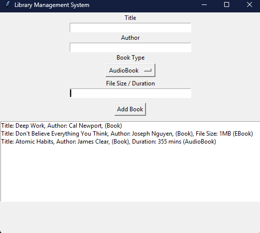

# 📚 Library Management System

[](LICENSE)
[](https://www.python.org/ )
[](#)
[](#)

A simple **Library Management System** built using **Python** and **tkinter** for the GUI. Supports **Books**, **EBooks**, and **AudioBooks** using **object-oriented programming** principles like **inheritance** and **method overriding**.

---

## 🧱 Features

- Add and display different types of books:
  - 📖 Regular Books
  - 📚 EBooks (with file size)
  - 🎧 AudioBooks (with duration)
- GUI interface using `tkinter`
- Clean folder structure and modular code
- Easy to extend for new book types or features

---

## 📁 Folder Structure

    ```bash
    library_system/
    ├── main.py # Entry point of the application
    ├── library_gui.py # GUI interface using tkinter
    ├── library/ # Package containing book and library classes
    │ ├── init .py # Makes the folder a Python package
    │ ├── book.py # Base Book class
    │ ├── ebook.py # EBook subclass
    │ ├── audiobook.py # AudioBook subclass
    │ └── library_manager.py # Manages the collection of books
    ├── requirements.txt # Python dependencies
    ├── LICENSE # MIT License file
    ├── README.md # This file
    ├── screenshots/ # Folder for GUI screenshots
    │ └── library_gui.png # (Example screenshot)
    └── .gitignore # Files to ignore in git
    ```

---

## 🚀 How to Run

1. Clone the repository:

   ```bash
   git clone https://github.com/Soumyadeeps006/library-management-system.git 
   cd library-management-system
   ```

2. Install dependencies:

    ```bash
    pip install -r requirements.txt
    ```

3. Run the app:

    ```bash
    python main.py
    ```

---

## 🖥️ Screenshot



---

## 🛠️ Technologies Used

* Python 3.x
* tkinter for GUI
* OOP principles (inheritance, method overriding)

---

## 📌 Future Improvements (To-Do)

* Add search/filter functionality
* Save/load library to/from file
* Add delete/edit functionality
* Support for multiple libraries or users

---

## 🤝 Contributions
Contributions are welcome! Please open an issue or submit a pull request.

---

## 📄 License
This project is licensed under the MIT License – see the [LICENSE](LICENSE) file for details.

---

## 📬 Contact

Have a question or want to collaborate? 
📧 Reach me at Soumyadeeps006@gmail.com 
🐱 GitHub: https://github.com/Soumyadeeps006